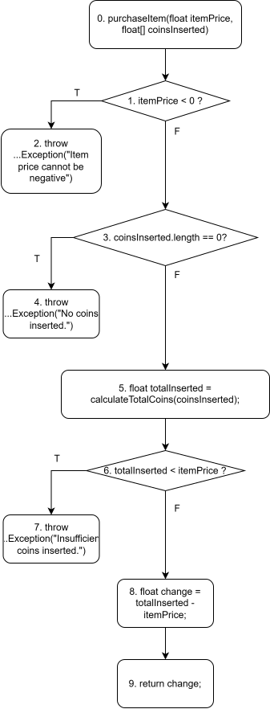

# Week 5 Homework

## Exercises in the slide

### 1: Trình bày các bước nhằm kiểm thử một đơn vị chương trình theo phương pháp kiểm thử dòng điều khiển với một độ đo kiểm thử cho trước

1. Từ đơn vị chương trình đã và độ đo kiểm thử cho trước, ta xây dựng đồ thị dòng điều khiển (CFG) tương ứng.
2. Ta xác định các đường đi của chương trình trên CFG sao cho khi chúng thực hiện thì độ đo kiểm thử tương ứng thỏa mãn
3. Với mỗi đường đi ta sinh ra một ca kiểm thử tương ứng (thỏa mãn các điều kiện tại các điểm quyết định).
4. Thực hiện các ca kiểm thử.

### 2. Hàm Grade

Đồ thị dòng điều khiển của hàm Grade ứng với độ đo C1 và C2:

Các đường đi và ca kiểm thử tương ứng để đạt được cả độ phủ C1 và C2:
1. 0 - 1 - 2(T) - 3   Test case 1: score = -1
2. 0 - 1 - 2(F) - 4(T) - 5 - 13   Test case 2: score = 10
3. 0 - 1 - 2(F) - 4(F) - 6(T) - 7 - 13   Test case 3: score = 8
4. 0 - 1 - 2(F) - 4(F) - 6(F) - 8(T) - 9 - 13   Test case 4: score = 7
5. 0 - 1 - 2(F) - 4(F) - 6(F) - 8(F) - 10(T) - 11 - 13   Test case 5: score = 6
6. 0 - 1 - 2(F) - 4(F) - 6(F) - 8(F) - 10(F) - 12 - 13   Test case 6: score = 4

### 3. Hàm Sum(int a[], int n)

Đồ thị dòng điều khiển của hàm Sum ứng với độ đo C1 và C2:

Đường đi và ca kiểm thử tương ứng để đạt được độ phủ C1 và C2:
0 - 1 - 2 - 3(T) - 4 - 5 - 3(F) - 6
  Test case: a = {1}, n = 1

Các ca kiểm thử vào lặp for:
1. Vòng lặp chạy 0 lần: 
Test case: a = null, n = 0
2. Vòng lặp chạy 1 lần: 
Test case: a = {52}, n = 1
3. Vòng lặp chạy 2 lần: 
Test case: a = {11, -29}, n = 2
4. Vòng lặp chạy 10 lần: 
Test case: a = {1, 2, 3, 4, 5, 6, 7, 8, 9, 10}, n = 10

### 4. Hàm foo

Đồ thị dòng điều khiển của hàm foo ứng với độ đo C2:

Các đường đi và ca kiểm thử tương ứng để đạt được độ phủ C2:
1. 0 - 1 - 2(65) - 3 - 4 - 10 Test case 1: x = 65
2. 0 - 1 - 2(66) - 5 - 6 - 10 Test case 2: x = 66
3. 0 - 1 - 2(67) - 7 - 8 - 10 Test case 3: x = 67
4. 0 - 1 - 2(default) - 9 - 10  Test case 4: x = 69

## Testing a sample program with control flow testing of C2 coverage

Let's consider a function that simulates a simple vending machine, where users can purchase items using coins.

**Specification:**

_Function:_ PurchaseItem 
_Description:_ This function simulates a vending machine that allows users to purchase items by inserting coins. It calculates the change to be returned to the user after a purchase.

**Parameters:**
1. ItemPrice (float): The price of the item to be purchased.
2. CoinsInserted (float[]): An array containing the values of coins (e.g., 0.25 for a quarter, 1.0 for a dollar) inserted by the user.

**Rules:**
1. The ItemPrice must be a non-negative value.
2. The CoinsInserted array must contain at least one coin value.
3. The total value of coins inserted must be greater than or equal to the item price.
4. The function should calculate and return the change to be returned to the user after deducting the item price.

**Implementation**: [VendingMachine.java](VendingMachine.java)

**Control flow graph:**

**Control flow paths and corresponding test cases that achieve branch coverage criterion:**
1. 0 - 1(T) - 2 
Test case 1: itemPrice = -10.25, coinsInserted = {1.0, 2.0}
2. 0 - 1(F) - 3(T) - 4 
Test case 2: itemPrice = 5.75, coinsInserted = {}
3. 0 - 1(F) - 3(F) - 5 - 6(T) - 7  
Test case 3: itemPrice = 50.5, coinsInserted = {1, 2, 5, 0.25}
4. 0 - 1(F) - 3(F) - 5 - 6(F) - 8 - 9  
Test case 4: itemPrice = 2.25, coinsInserted = {.25, .25, .25, .25, .25, .25, .25, .25, .1, .1, .1}

**Testing report**
| Test Case # | Input                                                                                             | Expected Output          | Actual Output            |
|-------------|---------------------------------------------------------------------------------------------------|--------------------------|--------------------------|
| 1           | itemPrice = -10.25, coinsInserted = {1.0, 2.0}                                                    | IllegalArgumentException | IllegalArgumentException |
| 2           | itemPrice = 5.75, coinsInserted = {}                                                              | IllegalArgumentException | IllegalArgumentException |
| 3           | itemPrice = 50.5, coinsInserted = {1.0, 2.0, 5.0, 0.25}                                           | IllegalArgumentException | IllegalArgumentException |
| 4           | itemPrice = 2.25, coinsInserted = {0.25, 0.25, 0.25, 0.25, 0.25, 0.25, 0.25, 0.25, 0.1, 0.1, 0.1} | 0.05                     | 0.05                     |

Total passed: 4/4