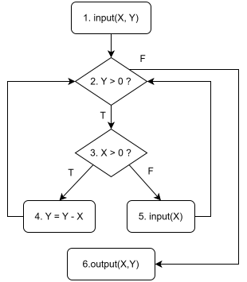
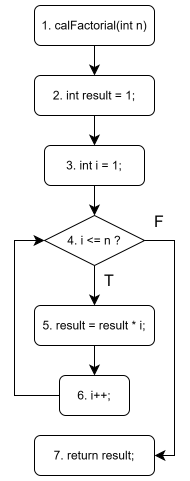
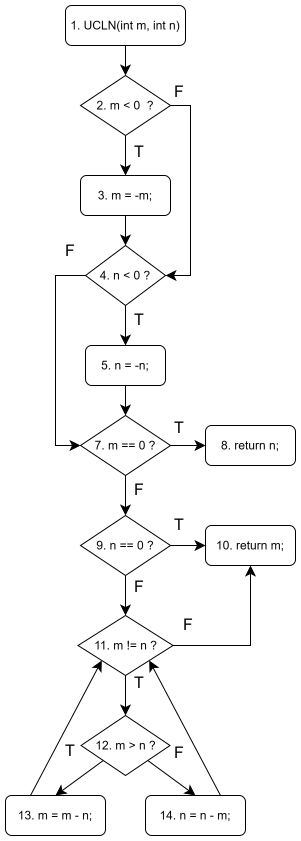
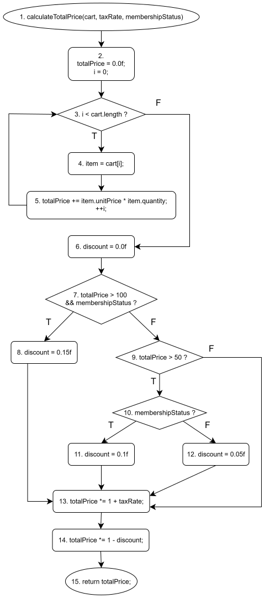

# Week 6 Homework

## Bài tập trên slide

### Bài 1

Để áp dụng phương pháp kiểm thử dòng dữ liệu động, chúng ta phải xác định các đường dẫn chương trình có điểm đầu vào và điểm đầu ra sau cho nó bao phủ việc gán giá trị và sử dụng mỗi biến của chương trình/đơn vị chương trình cần kiểm thử. Cụ thể, chúng ta cần thực hiện các bước sau:

1. Xây dựng đồ thị dòng dữ liệu của chương trình/đơn vị chương trình.
2. Chọn một hoặc một số tiêu chí kiểm thử dòng dữ liệu (all-def, all-use...).
3. Xác định các đường dẫn chương trình phù hợp với tiêu chí kiểm thử đã chọn.
4. Lấy ra các biểu thức điều kiện từ tập các đường đi, thực hiện giải các biểu thức điều kiện để có các giá trị đầu vào cho các ca kiểm thử tương ứng với các đường đi này và tính toán giá trị đầu ra mong đợi của mỗi ca kiểm thử.
5. Thực hiện các ca kiểm thử để xác định các lỗi (có thể có) của chương trình.
6. Sửa các lỗi (nếu có) và thực hiện lại tất cả các ca kiểm thử trong trường hợp bước trên phát hiện ra lỗi.

### Bài 2

Đồ thị dòng điều khiển CFG của đoạn mã là:

Các du pairs cho biến X và Y và các ca kiểm thử tương ứng để đạt được độ đo all-use là

| Variable | Def-use pair |    Def-clear path    |                Complete Path                 | Test case input |     |
| :------: | :----------: | :------------------: | :------------------------------------------: | :-------------: | --- |
|          |              |                      |                                              |       _X_       | _Y_ |
|   _X_    |  (1, 3(T))   |     1-2(T)-3(T)      |             1-2(T)-3(T)-4-2(F)-6             |        5        | 4   |
|          |  (1, 3(F))   |     1-2(T)-3(F)      |       1-2(T)-3(F)-5-2(T)-3(T)-4-2(F)-6       |     -1, 11      | 11  |
|          |    (1, 4)    |    1-2(T)-3(T)-4     |             1-2(T)-3(T)-4-2(F)-6             | specified above |     |
|          |    (1, 6)    | 1-2(T)-3(T)-4-2(F)-6 |             1-2(T)-3(T)-4-2(F)-6             | specified above |     |
|          |  (5, 3(T))   |     5-2(T)-3(T)      |       1-2(T)-3(F)-5-2(T)-3(T)-4-2(F)-6       | specified above |     |
|          |  (5, 3(F))   |     5-2(T)-3(F)      | 1-2(T)-3(F)-5-2(T)-3(F)-5-2(T)-3(T)-4-2(F)-6 |    -5, 0, 29    | 29  |
|          |    (5, 4)    |    5-2(T)-3(T)-4     |       1-2(T)-3(F)-5-2(T)-3(T)-4-2(F)-6       | specified above |     |
|          |    (5, 6)    |       5-2(F)-6       |       1-2(T)-3(F)-5-2(T)-3(T)-4-2(F)-6       | specified above |     |
|   _Y_    |  (1, 2(T))   |        1-2(T)        |             1-2(T)-3(T)-4-2(F)-6             | specified above |     |
|          |  (1, 2(F))   |        1-2(F)        |                   1-2(F)-6                   |       29        | -11 |
|          |    (1, 4)    |    1-2(T)-3(T)-4     |             1-2(T)-3(T)-4-2(F)-6             | specified above |     |
|          |    (1, 6)    |       1-2(F)-6       |                   1-2(F)-6                   | specified above |     |
|          |  (4, 2(T))   |        4-2(T)        |       1-2(T)-3(T)-4-2(T)-3(T)-4-2(F)-6       |        5        | 8   |
|          |  (4, 2(F))   |        4-2(F)        |             1-2(T)-3(T)-4-2(F)-6             | specified above |     |
|          |    (4, 4)    |    4-2(T)-3(T)-4     |       1-2(T)-3(T)-4-2(T)-3(T)-4-2(F)-6       | specified above |     |
|          |    (4, 6)    |       4-2(F)-6       |             1-2(T)-3(T)-4-2(F)-6             | specified above |     |

Ta cần tổng cộng 5 test case để đạt độ phủ all-use.

### Bài 3

Các câu lệnh def, c-use, p-use của các biến n, result, i được liệt kê trong bảng sau:

| statement type |                                n                                 |                   result                    |           i           |
| :------------: | :--------------------------------------------------------------: | :-----------------------------------------: | :-------------------: |
|      def       | n được định nghĩa ở lệnh truyền tham số: int calFactorial(int n) | 1. int result = 1; 2. result = result \* i; | 1. int i = 1; 2. i++; |
|     c-use      |                                                                  |            result = result \* i;            |         i++;          |
|     p-use      |                          while (i <= n)                          |                                             |    while (i <= n)     |

Đồ thị dòng điều khiển của hàm đã cho:

### Bài 4

- Def x: 0, 3
- P-use x: 1, 4
- C-use x: 3, 5
- Def y: 0, 2, 5
- P-use y: 1, 4
- C-use y: 6

Tất cả các Def-clear-path và du-path của biến x và y là:

| Variable | Du-pair  | Def-clear-path |  Du-path  |
| :------: | :------: | :------------: | :-------: |
|   _x_    | (0, 1-2) |      0-1       |   0-1-2   |
|          | (0, 1-3) |      0-1       |   0-1-3   |
|          |  (0, 3)  |     0-1-3      |   0-1-3   |
|          | (0, 4-5) |      0-4       | 0-1-2-4-5 |
|          | (0, 4-6) |      0-4       | 0-1-2-4-6 |
|          |  (0, 5)  |   0-1-2-4-5    | 0-1-2-4-5 |
|          | (3, 4-5) |      3-4       |   3-4-5   |
|          | (3, 4-6) |      3-4       |   3-4-6   |
|          |  (3, 5)  |     3-4-5      |   3-4-5   |
|   _y_    | (0, 1-2) |      0-1       |   0-1-2   |
|          | (0, 1-3) |      0-1       |   0-1-3   |
|          | (0, 4-5) |      0-4       | 0-1-3-4-5 |
|          | (0, 4-6) |      0-4       | 0-1-3-4-6 |
|          |  (0, 6)  |   0-1-3-4-6    | 0-1-3-4-6 |
|          | (2, 4-5) |      2-4       |   2-4-5   |
|          | (2, 4-6) |      2-4       |   2-4-6   |
|          |  (2, 6)  |     2-4-6      |   2-4-6   |
|          |  (5, 6)  |      5-6       |    5-6    |

Các đường đi đầy đủ (complete path) đạt được độ phủ All-p-uses/Some-c-uses của x và y là: 0-1-2-4-6, 0-1-3-4-6, 0-1-2-4-5-6, 0-1-3-4-5-6. Ta tìm các đường đi này nhờ sử dụng bảng sau:

| Variable | Du-pair  |  Du-path  | Complete path |
| :------: | :------: | :-------: | :-----------: |
|   _x_    | (0, 1-2) |   0-1-2   |   0-1-2-4-6   |
|          | (0, 1-3) |   0-1-3   |   0-1-3-4-6   |
|          | (0, 4-5) | 0-1-2-4-5 |  0-1-2-4-5-6  |
|          | (0, 4-6) | 0-1-2-4-6 |   0-1-2-4-6   |
|          | (3, 4-5) |   3-4-5   |  0-1-3-4-5-6  |
|          | (3, 4-6) |   3-4-6   |   0-1-3-4-6   |
|   _y_    | (0, 1-2) |   0-1-2   |   như trên    |
|          | (0, 1-3) |   0-1-3   |   như trên    |
|          | (0, 4-5) | 0-1-3-4-5 |  0-1-3-4-5-6  |
|          | (0, 4-6) | 0-1-3-4-6 |   0-1-3-4-6   |
|          | (2, 4-5) |   2-4-5   |  0-1-2-4-5-6  |
|          | (2, 4-6) |   2-4-6   |   0-1-2-4-6   |
|          |  (0, 6)  | 0-1-3-4-6 |   0-1-3-4-6   |
|          |  (2, 6)  |   2-4-6   |   0-1-2-4-6   |
|          |  (5, 6)  |    5-6    |  0-1-3-4-5-6  |

Các đường đi đầy đủ đạt độ phủ All-c-uses/Some-p-uses của x và y là: 0-1-3-4-6, 0-1-2-4-5-6, 0-1-3-4-5-6, 0-1-2-4-6, nhận được từ bảng sau:

| Variable | Du-pair |  Du-path  | Complete path |
| :------: | :-----: | :-------: | :-----------: |
|   _x_    | (0, 3)  |   0-1-3   |   0-1-3-4-6   |
|          | (0, 5)  | 0-1-2-4-5 |  0-1-2-4-5-6  |
|          | (3, 5)  |   3-4-5   |  0-1-3-4-5-6  |
|   _y_    | (0, 6)  | 0-1-3-4-6 |   0-1-3-4-6   |
|          | (2, 6)  |   2-4-6   |   0-1-2-4-6   |
|          | (5, 6)  |    5-6    |  0-1-2-4-5-6  |

Nếu cạnh 1-3 là $x + y = 4$ và cạnh 4-5 là $x^2 + y^2 > 17$ thì đường đi (0 - 1 - 3 - 4 - 5 - 6) vẫn có thể thực thi được, vì chưa có ràng buộc gì về lệnh Def(x) ở đỉnh 3. Ví dụ, có thể tại đỉnh 1, x = 0, y = 4, điều kiện 1-3 thỏa mãn, tại định 3, x được gán lại thành 100, khi đó điều kiện 4-5 thỏa mãn.

Tại đỉnh 3 có cả lệnh Def(x) và C-use(x) nhưng không tồn tại mối quan hệ def-use là vì lệnh C-use(x) được chạy trước Def(x) và không có đường đi từ 3 quay lại 3 nên từ Def(x) ở đỉnh 3 không thể đi đến C-use(x) ở đỉnh 3.

### Bài 5

Đồ thị dòng điều khiển cho hàm UCLN là:

Các đường đi và đầu vào của các ca kiểm thử tương ứng để đạt được độ phủ C2 là:

1. Path 1: 1-2(T)-3-4(T)-5-7(F)-9(F)-11(F)-10  
   Test case 1: m = -4, n = -4
2. Path 2: 1-2(F)-4(T)-5-7(F)-9(F)-11(T)-12(F)-14-11(F)-10  
   Test case 2: m = 2, n = -4
3. Path 3: 1-2(F)-4(F)-7(F)-9(F)-11(T)-12(T)-13-11(F)-10  
   Test case 3: m = 4, n = 2
4. Path 4: 1-2(F)-4(F)-7(T)-8  
   Test case 4: m = 0, n = 54395803
5. Path 5: 1-2(F)-4(F)-7(F)-9(T)-10  
   Test case 5: m = 43589234, n = 0

- Def(m) = {1, 3, 13}
- Use(m) = {2, 3, 7, 10, 11, 12, 13, 14}
- Def(n) = {1, 5, 14}
- Use(n) = {4, 5, 8, 9, 11, 12, 13, 14}

Các đường đi và đầu vào của ca kiểm thử tương ứng để đạt được độ phủ all-defs là 2 cột cuối của bảng sau:

| Variable | Du-pair  |             Def-clear path             |                        Complete path                         | Test case |  input  |
| :------: | :------: | :------------------------------------: | :----------------------------------------------------------: | :-------: | :-----: |
|          |          |                                        |                                                              |    _m_    |   _n_   |
|   _m_    | (1, 14)  | 1-2(F)-4(T)-5-7(F)-9(F)-11(T)-12(F)-14 |       1-2(F)-4(T)-5-7(F)-9(F)-11(T)-12(F)-14-11(F)-10        |   2911    |  -5822  |
|          | (3, 13)  |    3-4(F)-7(F)-9(F)-11(T)-12(T)-13     |       1-2(T)-3-4(F)-7(F)-9(F)-11(T)-12(T)-13-11(F)-10        |   -2258   |  1129   |
|          | (13, 11) |                13-11(F)                | 1-2(F)-4(F)-7(F)-9(F)-11(T)-12(T)-13-11(T)-12(T)-13-11(F)-10 |   3387    |  1129   |
|   _n_    |  (1, 5)  |            1-2(T)-3-4(T)-5             |              1-2(T)-3-4(T)-5-7(F)-9(F)-11(F)-10              |  -442024  | -442024 |
|          | (5, 13)  |       5-7(F)-9(F)-11(T)-12(T)-13       |       1-2(F)-4(T)-5-7(F)-9(F)-11(T)-12(T)-13-11(F)-10        |  884048   | -442024 |
|          | (14, 10) |              14-11(F)-10               |        1-2(F)-4(F)-7(F)-9(F)-11(T)-12(F)-14-11(F)-10         |  442024   | 884048  |

## Kiểm thử một hàm sử dụng phương pháp kiểm thử dòng dữ liệu với độ phủ all-uses

Quay trở lại ví dụ về tính giá cả tổng cộng của các sản phẩm trong một giỏ hàng, ta mở rộng thêm hàm này bằng việc xét kỹ hơn điều kiện giảm giá. Thay vì nhận đầu vào là một giá trị giảm giá cho sẵn, hàm sẽ tính toán ra giá trị đó dựa trên tổng giá trị các sản phẩm và việc liệu khách hàng có phải là thành viên hay không. Đây là đặc tả của hàm đã chỉnh sửa:

### Đặc tả

**Hàm:** CalculateTotalPrice

**Mô tả:** Hàm này tính tổng giá cả của các sản phẩm trong một giỏ hàng, áp dụng giảm giá dựa trên tổng giá trị sản phẩm và liệu khách hàng có là hành viên hay không.

**Tham số:**

- cart (CartItem[]): Danh sách các vật phẩm có trong giỏ hàng.
- taxRate (double): Thuế suất được áp dụng trên tổng giá trị hàng hóa.
- membershipStatus (boolean): Một giá trị boolean cho biết liệu khách hàng có phải là thành viên hay không (`True` nếu khách hàng là thành viên, nếu không là `False`).

**Quy tắc:**

1. Nếu tổng giá trị lớn hơn $100 và khách hàng là một thành viên, áp dụng giảm giá 15%.
2. Nếu tổng giá trị lớn hơn $50 và nếu khách hàng là một thành viên thì áp dụng giảm giá 10%, còn nếu khách hàng không là thành viên thì áp dụng giảm giá 5%.
3. Trong trường hợp còn lại, không có giảm giá được áp dụng.

**Implementation:** [Ecommerce.java](/demo/src/main/java/testing/homework/Ecommerce.java)

**Test:** [CalculateTotalPriceDataFlowTest.java](/demo/src/test/java/EcommerceDataFlowTest.java)

Đồ thị dòng điểu khiển của hàm calculateTotalPrice là:

Phân tích đồ thị dòng điều khiển, ta có đầu vào các ca kiểm thử để đạt được độ phủ all-uses được ghi ở các cột cuối cùng trong bảng sau:

|      Variable      |  Du-pair   |          Def-clear path          |                  Complete path                  |        Test case input        |           |                    |
| :----------------: | :--------: | :------------------------------: | :---------------------------------------------: | :---------------------------: | :-------: | ------------------ |
|                    |            |                                  |                                                 |            _cart_             | _taxRate_ | _membershipStatus_ |
|      _cart_\*      |   (1, 4)   |            1-2-3(T)-4            |       1-2-3(T)-4-5-3(F)-6-7(T)-8-13-14-15       |   {("trousers", 5, 500.99)}   |   0.05    | True               |
|     _taxRate_      |  (1, 13)   |     1-2-3(F)-6-7(F)-5(F)-13      |          1-2-3(F)-6-7(F)-9(F)-13-14-15          |              {}               |   0.05    | True               |
| _membershipStatus_ | (1, 7(T))  |     1-2-3(T)-4-5-3(F)-6-7(T)     |       1-2-3(T)-4-5-3(F)-6-7(T)-8-13-14-15       |           như trên            |           |                    |
|                    | (1, 7(F))  |     1-2-3(T)-4-5-3(F)-6-7(F)     | 1-2-3(T)-4-5-3(F)-6-7(F)-9(T)-10(F)-12-13-14-15 | {("refrigerator", 1, 1395.0)} |   0.05    | False              |
|                    | (1, 10(T)) | 1-2-3(T)-4-5-3(F)-6-7(F)-9-10(T) | 1-2-3(T)-4-5-3(F)-6-7(F)-9(T)-10(T)-11-13-14-15 |     {("shirt", 2, 30.5)}      |   0.05    | True               |
|                    | (1, 10(F)) | 1-2-3(T)-4-5-3(F)-6-7(F)-9-10(F) | 1-2-3(T)-4-5-3(F)-6-7(F)-9(T)-10(F)-12-13-14-15 |     {("socks", 10, 5.5)}      |   0.05    | False              |
|    _totalPrice_    |   (2, 5)   |            2-3(T)-4-5            |     1-2-3(T)-4-5-3(F)-6-7(F)-9(F)-13-14-15      |   {("biscuit box", 1, 10)}    |   0.05    | False              |
|                    | (2, 7(F))  |          2-3(F)-6-7(F)           |          1-2-3(F)-6-7(F)-9(F)-13-14-15          |           như trên            |           |                    |
|                    |  (2, 13)   |      2-3(F)-6-7(F)-9(F)-13       |          1-2-3(F)-6-7(F)-9(F)-13-14-15          |           như trên            |           |                    |
|       _item_       |   (4, 5)   |               4-5                |     1-2-3(T)-4-5-3(F)-6-7(F)-9(F)-13-14-15      |           như trên            |           |                    |
|     _discount_     |  (6, 14)   |        6-7(F)-9(F)-13-14         |     1-2-3(T)-4-5-3(F)-6-7(F)-9(F)-13-14-15      |           như trên            |           |                    |
|                    |  (8, 14)   |             8-13-14              |       1-2-3(T)-4-5-3(F)-6-7(T)-8-13-14-15       |           như trên            |           |                    |
|                    |  (11, 14)  |             11-13-14             | 1-2-3(T)-4-5-3(F)-6-7(F)-9(T)-10(T)-11-13-14-15 |           như trên            |           |                    |
|                    |  (12, 14)  |             12-13-14             | 1-2-3(T)-4-5-3(F)-6-7(F)-9(T)-10(F)-12-13-14-15 |           như trên            |           |                    |

(\*): Trong đồ thị dòng điều khiển, biến `i` được em thêm vào chỉ có tác dụng minh họa vòng for. Vì vòng for này là dùng cú pháp của Java nên sẽ không thể có lỗi liên quan đến biến đếm nên ta không cần kiểm thử biến i và các lệnh `i = 0`, `i < cart.length` và `item = cart[i]`.

Kết quả kiểm thử như sau:

|  #  |          Test input           |           |                    | Expected output | Actual output | Verdict |
| :-: | :---------------------------: | :-------: | :----------------: | :-------------: | :-----------: | :-----: |
|     |            _cart_             | _taxRate_ | _membershipStatus_ |                 |               |         |
|  1  |   {("trousers", 5, 100.0)}    |   0.05    |        True        |     446.25      |    446.25     | Passed  |
|  2  | {("refrigerator", 1, 1395.0)} |   0.05    |       False        |     1391.51     |    1391.51    | Passed  |
|  3  |     {("shirt", 2, 30.5)}      |   0.05    |        True        |      57.65      |     57.65     | Passed  |
|  4  |     {("socks", 10, 5.5)}      |   0.05    |       False        |      54.86      |     54.86     | Passed  |
|  5  |   {("biscuit box", 1, 10)}    |   0.05    |       False        |      10.5       |     10.5      | Passed  |
